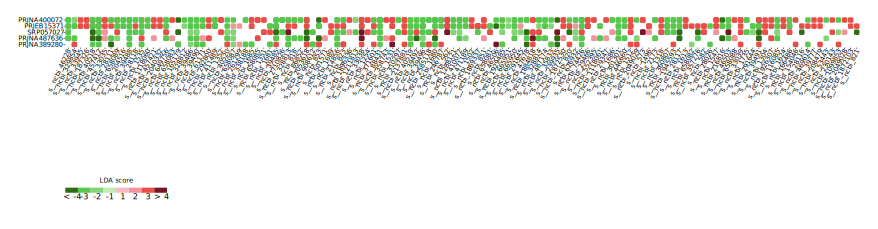
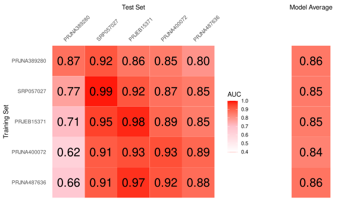

# Modeling based on gut microbiome abundance - GMModel

The code and key intermediate files in this repository correspond to the following manuscript:

 _Li et al. Gut Microbes. Large-scale cross-cohort analysis identifies determinants of reproducible gut microbiome alterations._ [Reference click here](https://)
  
Our goal with this work was to find determinants of reproducible gut microbiome alterations. We we systematically evaluated the cross-cohort performance of gut microbiome-based machine-learning classifiers for 20 diseases. 

## Table of Contents

- [Modeling based on gut microbiome abundance - GMModel](#modeling-based-on-gut-microbiome-abundance---gmmodel)
  - [Table of Contents](#table-of-contents)
  - [Organization](#organization)
  - [Software requirement](#software-requirement)
  - [Running sample](#running-sample)
  - [Expected Output](#expected-output)


## Organization
* _**00_model_FUN**_ contains R scripts of all pipeline function. 

* _**01_data**_ contains RData for analysis and plot.

* _**02_figure**_ contains PDFs of the manuscript figures.These are ordered by figure number.

* _**03_table**_ contains CSVs of the manuscript tables.These are ordered by table number.

* _**04_model_raw_RData**_ contains a model sample .
  
* _**Rscripts**_ Rscripts for modeling and plotting. 
  * _F1.R-F5.R, FS1.R-FS8.R_,  Plot Rscripts
  * _F0.R_, Prepare the data for plot
  * _00_model_MSI.R_, Intra-cohort and LODO modeling and LEfSe analysis
  * _01_CCM & SCM.R_, CCM and SCM modeling


## Software requirement
  * R version: 4.1.2
  * A list of some required R packages version:
    * SIAMCAT_1.9.0 
    * microbiomeMarker_1.0.2
    * limma_3.46.3
    * MMUPHin_1.4.2
    * smotefamily_1.3.1
    * ggpubr_0.4.0
    * pROC_1.18.0
    * mltools_0.3.5

  
## Running sample
Modeling and LEfSe on CD dataset
  * Load function and data:
  ```
{
  source('00_model_FUN/siamcat_models.R')
  source('00_model_FUN/siamcat_models_adj.R')
  source('00_model_FUN/my_lodo.R')
  source('00_model_FUN/my_lodo.adj.R')
}
load('./01_data/cohort_info.RData')

method='lasso'
label='lasso_adj_nc'
method_dir <- '02lasso'

pro1 <- unique(cross[,c('disease','num','data_type','taxon','group1','mesh')])
print(pro1)
i = c(1:nrow(pro1))[26] # i could be one of 1:nrow(pro1)
{  
  #input parameters
  project_stat0 <- subset(project_stat,disease==pro1$disease[i] & data_type==pro1$data_type[i])
  project_id0 <- project_stat0$project
  disease <- pro1[i,'disease'] 
  data_type <- pro1[i,'data_type'] 
  taxon <- pro1[i,'taxon'] 
  case_meshid <- pro1[i,'mesh'] # for example IBS:'D015212'
  control_meshid <- 'D006262' # health mesh ID
  
  load(paste0('01_data/feat_meta/',disease,'_',data_type,'_',taxon,'.RData'))
  feat_list <- my_data0$feat_list
  meta_list <- my_data0$meta_list
}   
```
Note that i could be one number of 1:nrow(pro1) for select different diaease. Here we chose CD for example
  * Intra-cohort modeling and LEfSe analysis
  ```   

model.adj <- my_result_adj(feat_list,meta_list,
                           method=method,label=label,
                           models=NULL,
                           num.folds=5, num.resample=3,
                           feature.type = "normalized",
                           is_cross=T,do.con=T,
                           pca_plot = F,imbalance = T,max_index=3)

  save(model.adj,file = paste('04_model_raw_RData/single_LODO/',method_dir,'/',case_meshid,'_',data_type,'.',taxon,'_',length(project_id0),'.','RData',sep = ''))
  marker.adj=my_marker_adj(feat_list,meta_list,NULL,NULL,T,T,T,
                           is_plot=F,lda_cutoff=2,nproj_cutoff=1,level=taxon,change_name=F)
  save(marker.adj,file = paste('04_model_raw_RData/single_LODO/',method_dir,'/','m_',case_meshid,'_',data_type,
                               '.',taxon,'_',length(project_id0),'.','RData',sep = ''))
  ```
Note:  
_method_, could be c("lasso", "enet", "ridge", "lasso_ll", "ridge_ll", "randomForest"), here we used lasso.   
 _feature.type_="normalized", z-score standardization before modeling  
 _imbalance_=T,  over-sampling by SMOTE,   
 _max_index_=3,  maximum between three and half ratio of large group number to small one, which represents the desired times of synthetic minority instances over the original number of majority instances in SMOTE method  
 _do.con=T_, adjust confounding factors  
 _is_cross_=T, batch effect correction  
 
 
  
  * Visualization:
  ```
p <- my_auc.heatmap(datas=model.adj$result,models=label)
my_marker.plot(markers_data=marker.adj$marker_data,feat_list=NULL,meta_list=NULL,lda_cutoff=2,nproj_cutoff=2,level=taxon)
```
Note:  
_lda_cutoff_ is the cutoff of LDA score of LEfSe.  
_nproj_cutoff_ is the number of cohort that same feature appears in one disease. If _nproj_cutoff_ is 1, all markers will be retained. If _nproj_cutoff_ is 2, only markers that appears in more than 2 cohorts will be retained.

## Expected Output

  * We have included the expected marker results from running CD dataset. This can be found in the 04_model_raw_RData/single_LODO/02lasso folder.
  * Running CD dataset should take ~2 minutes for intra-cohort when using a single core.
  This was tested on linux Ubuntu 20.04.3
  * LEfSe analysis plot   
  
  * Intra-cohort modeling plot  
  
  
